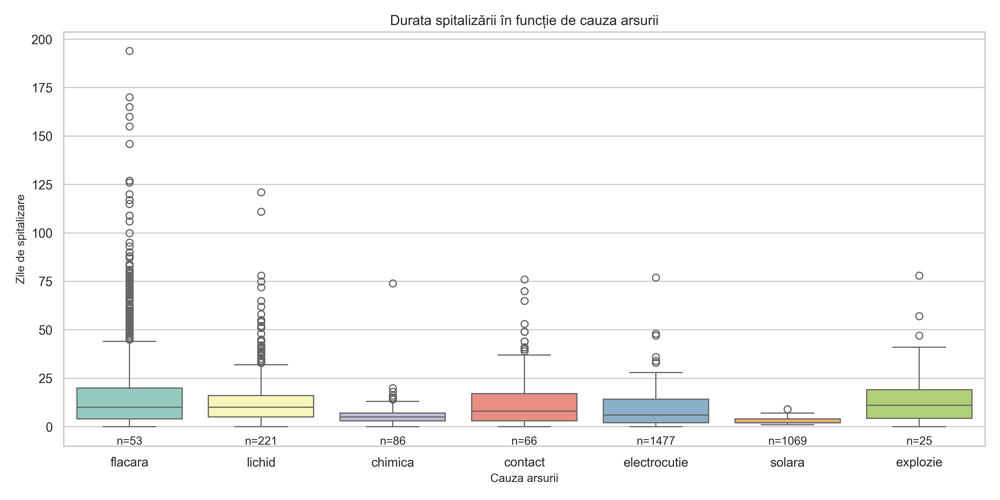
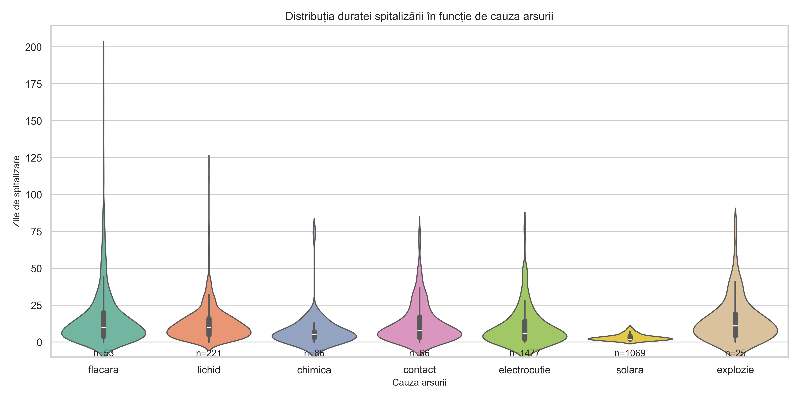
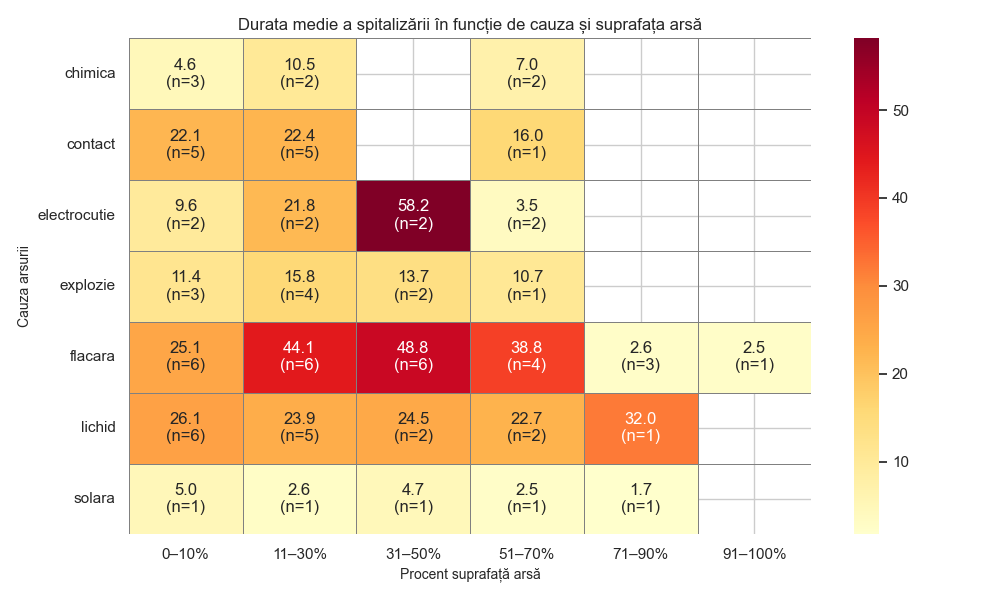
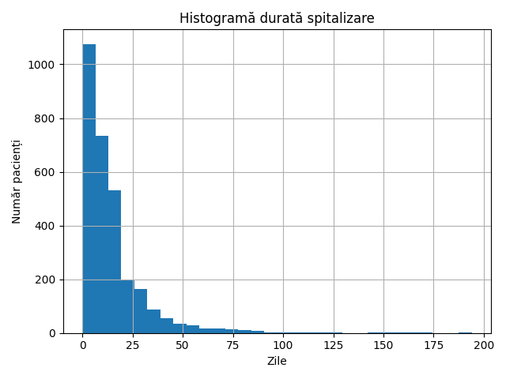

# analizaArsuri
Analize și grafice agregate despre arsură — versiune public-safe.

# Analiza Arsuri — Public-Safe Pipeline


**RO:** Proiect (\~1 lună) cu pipeline end-to-end pentru analiza pacienților cu arsuri: curățare, extragere variabile (cauză, TBSA), calcul **ABSI**, pivoți și vizualizări. Repo-ul include **doar cod, grafice agregate și cataloage public-safe** (fără date la nivel de pacient).

---

## Cuprins

* [Pipeline (pe scurt)](#pipeline-pe-scurt)
* [Cum rulezi](#cum-rulezi)
* [Structură proiect](#structură-proiect)
* [Cataloage incluse (public-safe)](#cataloage-incluse-public-safe)
* [Exemple de rezultate](#exemple-de-rezultate)
* [Confidențialitate](#confidențialitate)
* [Stack & licență](#stack--licență)

---

## Pipeline (pe scurt)

1. **Ingest & normalizare** — `main.py`, `baza_date.py`
   Selecție/redenumire coloane, conversii tip, deduplicare → tabele curate (local, nepublic).

2. **Analize pe zile/pacient** — `analize_pe_zi.py`
   Extrage numeric din `rezval`, normalizează denumiri, pivot „zi × pacient” (local).

3. **Feature engineering**

* **Cauză arsură:** `cauze_arsuri.py` (flacără/lichid/contact/electrocuție/chimică/solar/explozie)
* **TBSA (% ars):** `procente_arsura.py` (regex + reguli ICD)
* **Scor ABSI:** `scor_ABSI.py` (sex, vârstă, inhalatorie, grad, TBSA)

4. **Agregare per pacient** — `build_baza_pacienti_finala.py`
   Un rând/pacient: **durata spitalizării**, codificări (SEX, MEDIU, STATUS), rezumate analize.

5. **Pivoți public-safe** — `pas3_pivot_lot.py`, `pivot_arsuri.py`, `grafic_pivot.py`
   Nr. pacienți & durate medii; **celulele cu n<5 sunt mascate** → `pivot_arsuri_lot_public.xlsx`.

6. **Vizualizări & QA** — `violinplot_durata_pe_cauza.py`, `boxplot_durata_pe_cauza.py`, `grafic_arsuri.py`, `grafic_diagnostic.py`, `statistici_pacienti.py`, `verif_outlieri.py`
   PNG/SVG agregate (fără PII).

7. **Orchestrare** — `run_pipeline.py`
   `--public` folosește strict fișierele incluse în repo; pentru date reale se folosesc surse locale prin variabile de mediu.

---

## Cum rulezi

### 1) Mediu

```bash
# Windows
python -m venv .venv && .venv\Scripts\activate
# macOS / Linux
python3 -m venv .venv && source .venv/bin/activate

pip install -r requirements.txt  # (pandas, numpy, matplotlib, seaborn, openpyxl)
```

### 2) Mod public (regenerare grafice din pivoți public-safe)

```bash
python grafic_pivot.py
python violinplot_durata_pe_cauza.py
python boxplot_durata_pe_cauza.py
```

### 3) Mod privat (cu date locale, nepublice)

```bash
# Exemplu: setează calea către surse locale (necomise în git)
# Windows:
set SRC=private/PACIENTI_LOCAL.xlsx
# macOS / Linux:
export SRC=private/PACIENTI_LOCAL.xlsx

python run_pipeline.py
```

> Notă: editările de cale/argumente se fac la începutul scripturilor, dacă vrei rute personalizate.

---

## Structură proiect

```
.
├── main.py
├── run_pipeline.py
├── pas2_prepare_master.py
├── pas3_pivot_lot.py
├── analize_pe_zi.py
├── build_baza_pacienti_finala.py
├── procente_arsura.py
├── scor_ABSI.py
├── pivot_arsuri.py
├── grafic_pivot.py
├── violinplot_durata_pe_cauza.py
├── boxplot_durata_pe_cauza.py
├── verif_outlieri.py
├── cauze_arsuri.py
├── extracta_lista_coduri.py
├── grafic_arsuri.py
├── grafic_diagnostic.py
├── analize_lista.py
├── baza_date.py
├── baza_date_finala.py
├── statistici_pacienti.py
└── grafice/ *.png *.svg (exporturi agregate)
```

---

## Cataloage incluse (public-safe)

| Fișier                                       | Conținut                          | Public-safe |
| -------------------------------------------- | --------------------------------- | ----------- |
| `diagnostice_principale_unice_public.xlsx`   | listă coduri/denumiri diagnostice | ✅           |
| `interventii_chirurgicale_unice_public.xlsx` | listă intervenții                 | ✅           |
| `pivot_arsuri_lot_public.xlsx`               | pivoți cu **n<5** mascat          | ✅           |
| `analize_distincte.xlsx`                     | listă denumiri analize            | ✅           |
| `diagnostice_principale_unice.xlsx`          | listă diagnostice (fără PII)      | ✅           |
| `interventii_chirurgicale_unice.xlsx`        | listă intervenții (fără PII)      | ✅           |

> Toate celelalte `.xlsx` brute/derivate rămân private (ignorate prin `.gitignore`).

---

## Exemple de rezultate

<p align="center">
  
  
</p>
<p align="center">
  
  
</p>

---

## Confidențialitate

* Repo-ul **nu** conține date la nivel de pacient, PII sau date calendaristice reale.
* Pivoții publici aplică **small-cell suppression** (n<5).
* Date reale se folosesc doar local în `private/`/`data/` și **nu** se comit.

Checklist intern:

* [x] `.gitignore` blochează datele brute
* [x] Doar cataloagele whitelisted sunt incluse
* [x] Graficele sunt agregate și nu expun PII

---

## Stack & licență

**Stack:** Python · pandas · numpy · matplotlib · seaborn · openpyxl
**Licență:** MIT (poți ajusta după preferință)

---
